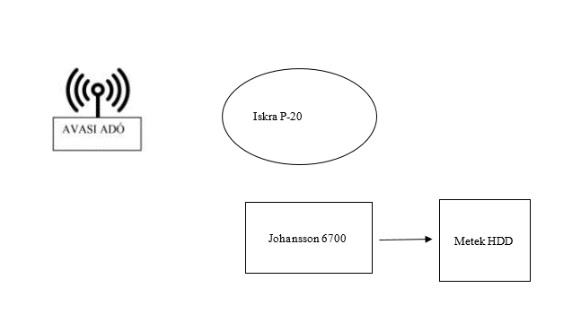

# Miskolci Szakképzési Centrum  
**Kandó Kálmán Informatikai Technikum**  
**Miskolc Palóczy u. 3.**

# MÉRÉSI JEGYZŐKÖNYV

**A mérést végző neve:** Erős Bence  
**A mérés tárgya:** Programozható Antennaerősítő-szűrő használata  
**A mérés száma:** 2. mérés  
**A mérés dátuma:** 2024. 10. 14  
**A mérést vezette:** Sándor Péter  

**Évfolyam:** 13. E  
**Csoport:** GYAK 2  
**Helyszín:** V3 Labor  

---

## 1. Mérés Célja

A **Johansson 6700 Profiler** antennaerősítő-szűrő megismerése és beállítása, különböző antennák jeleinek kezelése. Ez az eszköz a rádiófrekvenciás jelek szűrésére és erősítésére szolgál, különösen hasznos, ha különböző frekvenciasávokat célzottan akarunk feldolgozni és javítani az átvitel minőségét. Feladata, hogy egy antenna segítségével először befogjuk az **Avasi adó toronyból** sugárzott adásokat, majd a megfelelő frekvenciákat a **Johansson eszközzel** áthelyezzük, hogy a régi UTP kábeles rendszerben is zavartalanul lehessen TV-t nézni.

---

## 2. Helyszín

- **Koordináták:** 48°06’20”N 20°46’48”E  
- **Antenna Típus:** Iskra P-20  
- **Antenna magassága:** 1.5m  
- **Környezet:** V3 labor, Városi körülmények között  
- **Adó Távolsága:** 780m  

   
  
ADÓTORONY - VÉTELI HELY távolság

  
  
  

---

## 3. Alkalmazott Mérőeszközök és Készülékek

| Műszer neve                         | Típus           | Gyártási szám         |
| ----------------------------------- | --------------- | ---------------------- |
| Programozható antennaerősítő-szűrő  | Johansson 6700  |                        |
| Antenna                             | Iskra P-20      | 38331002931507         |
| Spektrum Analizátor                 | Metek HDD       |                        |

---

## 4. Blokkvázlat

- **Iskra P-20 Antenna**: az RF jelek vételére
- **Johansson 6700 Profiler**: az RF jelek erősítésére és szűrésére
- **Metek HDD Spektrum Analizátor**: az erősített és szűrt jelek vizsgálatára

---

## 5. Mérési Adatok és Eredmények

### Mért adatok

Az alábbi táblázat a különböző frekvenciasávokhoz tartozó mért jelerősségeket mutatja a Johansson 6700 Profiler használata nélkül és használatával.

| Csatorna (CH) | Frekvencia (MHz) | Jelszint (dBu) | Következő Csatorna (CH) | Következő Frekvencia (MHz) | Következő Jelszint (dBuV) |
|---------------|------------------|----------------|--------------------------|----------------------------|----------------------------|
| 28            | 530              | 64             | 40                       | 626                        | 100.8                      |
| 31            | 554              | 60             | 41                       | 634                        | 100.9                      |
| 35            | 586              | 60             | 42                       | 642                        | 100.8                      |
| 41            | 634              | 59             | 45                       | 650                        | 100.8                      |
| 45            | 666              | 59             | 48                       | 658                        | 100.6                      |
| 48            | 690              | 56             | 45                       | 666                        | 100.4                      |

### Eredmények értelmezése

A mérések során a Johansson 6700 Profiler a kiválasztott frekvenciasávokban stabil 30 dB erősítést biztosított. Az eredmények alapján a készülék sikeresen növelte a bemeneti jelerősséget, elősegítve a gyengébb jelek stabil vételét és további feldolgozását. Az eredmények az elvárásoknak megfelelően alakultak.

---

## 6. Elemzés és Értékelés

Az eredmények elemzése alapján a Johansson 6700 Profiler megbízható teljesítményt nyújtott. Az eszköz stabilan növelte a jelerősséget a kiválasztott frekvenciasávokban, ami lehetővé teszi a gyenge RF jelek minőségi javítását. Kalibrációs beállításai pontosak voltak, az eltérések minimálisak.

---

## 7. Hibák és Korlátozások

A mérés során az alábbi problémák észlelhetők:

- **Környezeti tényezők**: Az épületek közelsége és a labor elektromos eszközei interferenciát okoztak.
- **Antenna elhelyezése**: A viszonylag alacsony antennamagasság miatt nem volt optimális a vétel.
- **Interferencia**: A spektrumanalizátor néha külső zajokat érzékelt.

---

## 8. Következtetések és Javaslatok

- A mérés sikeresen demonstrálta a Johansson 6700 Profiler képességeit.
- Javasolt további méréseket végezni eltérő környezeti feltételek mellett.
- Fontos lenne nagyobb spektrális sávban is mérni.
- A rendszer zavartalanul működött a rövid UTP kábeles rendszeren keresztül is.

---

## 9. További mérési javaslatok a jobb vétel és minőség érdekében 

- **Antenna elhelyezése**: Javasolt az antennát magasabb pozícióba telepíteni.
- **Környezeti hatások minimalizálása**: Érdemes lenne tesztelni különböző környezeti feltételekkel.
- **További tesztek**: Érdemes más antennatípusokat is tesztelni.

---

## 10. Felhasznált Források

1. **Johansson 6700 felhasználói kézikönyv**  
2. **Iskra P-20 antenna műszaki leírás**  
3. **Műholdas és földi adóállomások jellemzői**

---

## 11. Magyarázatok és Lábtanulmányok

- **SNR (Signal-to-Noise Ratio)**: Jel és zaj viszonya decibelben.
- **QPSK**: Kvadratúra fáziseltolásos moduláció.
- **UTP kábel**: Árnyékolatlan sodrott érpárú kábel.

---

## 12. Jelerősség diagramok

  

---

## 13. Záró Összegzés

A mérés során a **Johansson 6700 Profiler** használatával sikerült a városi környezetben lévő antenna jeleinek kezelését és optimalizálását megvalósítani. Az eszköz hatékonyan használható a rövid UTP kábeles rendszerekben is.

---

## 14. Mért Képek

Kattins a részletekért

  
  
  
  
  
![Kép 
